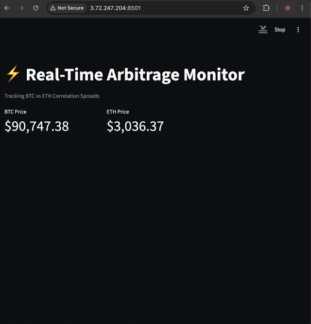

## ⚡ QuantStream: Real-Time Arbitrage Engine


QuantStream is a cloud-native, event-driven analytics engine designed to detect statistical arbitrage opportunities in cryptocurrency markets (BTC/ETH correlation spreads) with sub-second latency.

Unlike traditional polling bots, QuantStream leverages a streaming-first architecture capable of ingesting 800+ trades per second while maintaining strict fault tolerance. It is fully containerized and deployed on AWS via Terraform.

⸻

## 🎥 Live Demo




[Youtube link](https://youtube.com/shorts/6Xtn1XU8GI8)

⸻

The system is built on the **"Smart Pipes, Dumb Endpoints"** philosophy, ensuring decoupling and fault tolerance.

| Component | Technology | Role |
| :--- | :--- | :--- |
| **Ingestion Layer** | **Python (Asyncio/Aiohttp)** | Connects to Binance WebSockets. Normalizes raw trade streams into standard JSON events. |
| **Message Broker** | **Redpanda (Kafka API)** | High-performance C++ streaming platform. Buffers data to handle backpressure and prevent data loss. |
| **Processing Engine** | **Python (Pandas/Deque)** | Consumes streams. Maintains in-memory rolling windows (60s). Calculates correlation spreads in real-time. |
| **Storage Layer** | **TimescaleDB** | PostgreSQL extension optimized for high-velocity time-series data. Handles 1,000+ inserts/sec. |
| **Visualization** | **Streamlit** | Live operational dashboard for visualizing spreads and system health. |
| **Infrastructure** | **Terraform** | Fully reproducible Infrastructure as Code (IaC). Provisions AWS EC2, Security Groups, and Networking. |

---


⸻

## 📂 Project Structure

```bash
quant-platform/
├── dashboard/           # Streamlit Visualization App
├── infrastructure/      # Terraform Cloud Configuration
│   └── terraform/       # AWS Provisioning Scripts
├── services/
│   ├── ingestor/        # WebSocket Connector (Binance -> Kafka)
│   └── processor/       # Quant Logic (Kafka -> DB + Telegram)
├── docker-compose.yml   # Container Orchestration
└── .env                 # API Secrets (Not committed)
```

⸻

## 🧠 Engineering Tradeoffs & Design Decisions

1. **Streaming-First Architecture (Why Not Polling?)**

Tradeoff: Simpler REST polling vs higher-complexity streaming.

Decision: WebSocket + event streaming.
Polling introduces latency spikes and data loss during volatility. A streaming-first model ensures continuous ingestion with predictable latency under burst conditions.


2. **Redpanda vs Apache Kafka**

Tradeoff: Ecosystem maturity vs operational efficiency.

Decision: Redpanda (Kafka API compatible).
	•	C++ implementation → significantly lower memory footprint
	•	No JVM, no Zookeeper → simpler ops on small EC2 instances
	•	Better fit for cost-constrained, high-throughput pipelines

This allows sustained ingestion (800+ events/sec) on t3.medium / c7i-class instances without OOM risk.


3. **Decoupling Ingestion from Storage**

Tradeoff: Simpler synchronous writes vs fault tolerance.

Decision: Full decoupling via message broker.
	•	Ingest layer never blocks on database availability
	•	Redpanda buffers data during TimescaleDB outages
	•	Enables zero-downtime maintenance and schema migrations

This design treats the broker as a shock absorber between volatile markets and stateful systems.


4. **In-Memory Sliding Windows vs Stream Frameworks**

Tradeoff: Spark/Flink vs lightweight Python analytics.

Decision: Python + Deque + Pandas.
	•	Sub-second latency without cluster overhead
	•	Easier to audit, debug, and adapt to non-financial domains
	•	Optimized for real-time signals, not batch analytics

The system favors operational clarity and adaptability over maximal theoretical throughput.


5. **Cost-Aware Cloud Design**

Constraints: Ukraine-based deployment realities, limited infra budgets.

Optimizations include:
	•	Strict Docker CPU/memory limits
	•	Linux swap tuning to avoid burst OOM kills
	•	Avoidance of JVM-heavy components
	•	Terraform-managed reproducibility to minimize human error

Result: a production-grade real-time system that remains economically viable.

⸻

## 🚀 Key Features
	•	Real-Time Anomaly Detection: Flags BTC/ETH correlation divergence >0.5% within 60 seconds.
	•	Zero-Downtime Reliability: If TimescaleDB is unavailable, the ingest layer continues streaming with Redpanda buffering.
	•	Instant Alerts: Sends Telegram notifications when a trading signal or anomaly is detected.
	•	Memory-Efficient: Tuned for smaller AWS instances (c7i, t3.medium) using Linux swap and Docker resource limits.

⸻

## 🛠 Installation & Deployment

Prerequisites
	•	Docker & Docker Compose
	•	Terraform (for AWS deployment)
	•	AWS CLI configured with active credentials

⸻

## 1. Local Setup


## Clone the repository
git clone https://github.com/yourusername/quant-platform.git
cd quant-platform

## Configure secrets
cp .env.example .env
## Add TELEGRAM_TOKEN and CHAT_ID to .env


⸻

## 2. Launch the Stack

docker-compose up -d --build


⸻

## 3. Initialize the Database

The database schema is automatically provisioned on the first launch via `init.sql`.

To reset the data and re-initialize:
```bash
docker-compose down -v
docker-compose up -d
```
⸻

## ☁️ Cloud Deployment (AWS)

Terraform automates provisioning of a reproducible environment.

cd infrastructure/terraform

## Initialize + preview
terraform init
terraform plan

## Deploy to eu-central-1
terraform apply

EC2 instances automatically install Docker and Git via user_data scripts.

⸻

## 🔮 Future Roadmap (Defense Tech Pivot)

Although optimized for financial streaming, the architecture is domain-agnostic. Upcoming iterations will adapt the pipeline for UAV telemetry and anomaly detection:
	•	Protocol Swap: Replace Binance WebSocket with MAVLink.
	•	Logic Update: Substitute arbitrage signals with geofence, battery, and sensor anomaly analytics.
	•	Hardware Integration: Support for Pixhawk/ArduPilot and hardware-in-the-loop simulation.

⸻

## 👤 Author

Danylo Yuzefchyk
Systems Engineer & MLOps Specialist
