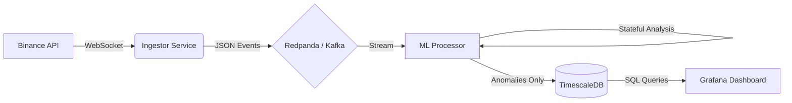
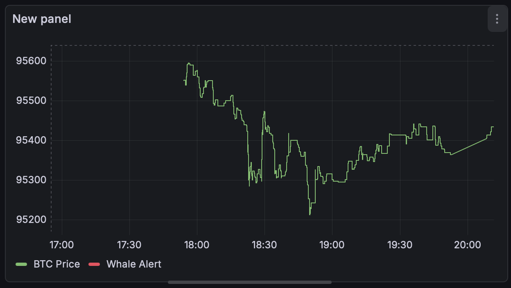

# ⚡ QuantStream: Real-Time Streaming Analytics for Crypto Markets


> **High-frequency anomaly detection pipeline processing cryptocurrency trades in real-time using Unsupervised Machine Learning.**

---

### 🔄 Project Evolution: v1.0 vs v2.0
This repository documents the evolution of a quantitative engine from a rule-based arbitrage bot to an AI-powered surveillance system.

| Feature | **v1.0 (Legacy)** | **v2.0 (Current)** |
| :--- | :--- | :--- |
| **Objective** | Statistical Arbitrage (Pair Trading) | Anomaly Detection (Market Surveillance) |
| **Logic** | Static Thresholds (`if spread > 0.5%`) | Unsupervised Learning (`IsolationForest`) |
| **Scope** | Multi-Asset Correlation (BTC vs ETH) | Single-Asset Microstructure (BTC) |
| **UI** | Streamlit (Tightly coupled to spread logic) | **Grafana (Streaming-native, anomaly-only)** |

👉 **[Click here to view the v1.0 Release (Arbitrage Engine)](https://github.com/znodanilo2017-byte/quant-stream/releases/tag/v1.0-arbitrage)**

---

## 📉 Project Overview
“The system is designed to run on a single low-memory cloud instance and sustain ~800 events/sec without backpressure.”

Traditional market alerts rely on static thresholds (e.g., "Alert if price > $100k"). **QuantStream** takes a quantitative approach using the **"Smart Pipes, Dumb Endpoints"** philosophy.

It ingests real-time trade data from Binance, streams it through **Redpanda**, and analyzes market structure using an **Isolation Forest** model. The system detects sudden liquidity injections, flash crashes, and market microstructure anomalies by analyzing volatility, RSI, and volume momentum—not just raw price.

### Key Features
* **Real-time Ingestion:** Websocket connection to Binance AggTrades (<100ms latency).
* **Event Streaming:** Decoupled architecture using **Redpanda** (Kafka-compatible).
* **ML Engine:** Stateful `IsolationForest` model calculating technical indicators on-the-fly (RSI-14, Volatility-20).
* **Time-Series Storage:** Optimized storage with **TimescaleDB** (PostgreSQL).
* **Visualization:** Live **Grafana** dashboard for anomaly monitoring.

---

## 🏗 Architecture

The system follows a microservices event-driven architecture:



1. **Ingestor:** Python service that connects to Binance WebSocket and pushes raw trades to Redpanda.
2. **Redpanda:** Acts as the high-throughput message bus, buffering data for the processor.
3. **ML Processor:** The "Brain". It maintains a rolling window of market data in memory (Deque) to calculate features and runs inference.
4. **TimescaleDB:** Stores trade history and flagged anomalies efficiently using hypertables.
5. **Grafana:** Visualizes the price action and highlights detected anomalies with red markers.

---

## ☁️ Cloud Deployment (Azure)
Deployed on Azure using Terraform (`Standard_D2as_v4`). 
- **Infrastructure as Code:** Terraform manages Networking, VM, and Security Groups.
- **CI/CD:** Docker Compose for container orchestration.

---

## 🧠 The "Brain": Machine Learning Logic

Unlike simple price alerts, QuantStream uses a multi-factor feature vector to detect anomalies.

**The Feature Vector:**
$$ X = [RSI_{14}, Volatility_{20}, VolumeChange] $$

* **RSI (Relative Strength Index):** Detects overbought/oversold conditions.
* **Volatility (Rolling StdDev):** Detects abnormal market stress.
* **Volume Momentum:** Detects sudden large-scale execution orders.

The model uses **Isolation Forest**, an unsupervised learning algorithm trained on historical Binance data. It isolates anomalies rather than profiling normal data points.

---

## 📸 Demo

*(Real-time anomaly detection.)*

## 🧠 Engineering Tradeoffs & Design Decisions

### 1. Streaming-First Architecture (Why Not Polling?)

**Tradeoff:** Simpler REST polling vs higher-complexity streaming.
**Decision:** WebSocket + Event Streaming.
Polling introduces latency spikes and data loss during volatility. A streaming-first model ensures continuous ingestion (800+ events/sec) with predictable latency, critical for capturing flash crashes.

### 2. Redpanda vs Apache Kafka

**Tradeoff:** Ecosystem maturity vs operational efficiency.
**Decision:** Redpanda.
Redpanda (C++) offers significantly lower memory footprint than JVM-based Kafka. It allows sustained ingestion on small cloud instances (t3.medium) without OOM risks.

### 3. Decoupling Ingestion from Storage

**Tradeoff:** Synchronous writes vs Fault Tolerance.
**Decision:** Full decoupling via Message Broker.
The ingest layer never blocks on database availability. Redpanda buffers data during DB maintenance, acting as a shock absorber during market volatility.

---

## 🔮 Future Roadmap (Defense Tech Pivot)

Although optimized for financial streaming, the architecture is **domain-agnostic**. Upcoming iterations will adapt the pipeline for **UAV telemetry**:

1. **Protocol Swap:** Replace Binance WebSocket with **MAVLink**.
2. **Logic Update:** Substitute arbitrage signals with geofence, battery, and vibration anomaly analytics.
3. **Hardware:** Integration with Pixhawk/ArduPilot for hardware-in-the-loop simulation.

---

## 🛠 Installation

### Prerequisites

* Docker & Docker Compose
* 4GB RAM recommended

### Quick Start

1.  **Clone the repository:**
    ```bash
    git clone [https://github.com/znodanilo2017-byte/quant-stream.git](https://github.com/znodanilo2017-byte/quant-stream.git)
    cd quant-stream
    ```

2.  **Setup Configuration:**
    Create the environment file from the example (default settings work out-of-the-box):
    ```bash
    cp .env.example .env
    ```

3.  **Start the pipeline:**
    ```bash
    docker-compose up -d --build
    ```

4.  **Access Grafana:**
    * URL: `http://localhost:3000`
    * Login: `admin` / `password`

---

## 👤 Author

**Danylo Yuzefchyk** *Systems Engineer & MLOps Specialist* [LinkedIn](https://www.linkedin.com/in/danylo-yuzefchyk-330413231/) | [GitHub](https://github.com/znodanilo2017-byte)

---

## 📜 License

This project is licensed under the MIT License.
