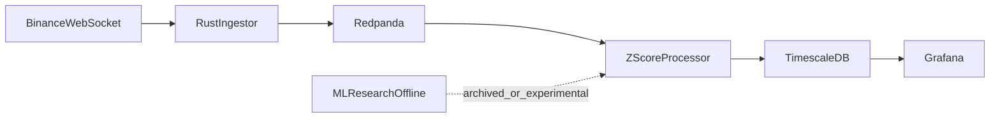

# QuantStream

QuantStream is a real-time crypto anomaly-monitoring demo built around a simple, explainable streaming pipeline:

- Rust ingests live Binance trades
- Redpanda carries normalized events
- Python applies rolling z-score anomaly detection
- TimescaleDB stores raw trades and anomaly events
- Grafana presents the official dashboard output

The goal of the final version is clarity and reproducibility, not model complexity.

## Final Runtime Story
The supported runtime path is:


```mermaid
flowchart LR
    Binance[BinanceWebSocket] --> RustIngestor[RustIngestor]
    RustIngestor --> Redpanda[Redpanda]
    Redpanda --> PyProcessor[ZScoreProcessor]
    PyProcessor --> Timescale[TimescaleDB]
    Timescale --> Grafana[Grafana]
    MLResearch[MLResearchOffline] -. archived_or_experimental .-> PyProcessor
```

Each component has one job:

1. `services/ingestor/crypto_ingestor` connects to Binance and publishes normalized trade events to `market_data`.
2. `services/processor/processor.py` consumes those events, stores every trade, computes rolling z-scores per symbol, and persists anomaly records.
3. `init.sql` creates the `trades` and `anomalies` hypertables used by the runtime.
4. `grafana/provisioning` provisions the datasource and dashboard automatically on startup.

## What The System Outputs
Grafana is the official output of the project. The provisioned dashboard shows:

- live trade price by symbol
- rolling volume by symbol
- anomaly counts and max absolute z-score
- recent anomaly events with timestamp, symbol, price, and z-score
- simple pipeline health metrics such as recent event throughput and active symbols

This keeps the demo focused on an explainable detection pipeline rather than an overstated ML claim.

## What This Demonstrates
- resilient market-data ingestion from a live websocket source into an event bus
- decoupled streaming analytics with a transparent z-score detector
- time-series persistence optimized for Grafana queries
- infrastructure and dashboards defined in-repo for reproducible demos

## Why Z-Score
The production processor uses rolling z-score anomaly detection because it is:

- easy to explain in an interview or portfolio walkthrough
- cheap to run in a streaming loop
- straightforward to validate in Grafana
- more honest than presenting incomplete live ML inference as production-ready

An event is flagged when the latest trade price deviates from the rolling mean by at least the configured threshold.

## ML Status
Machine learning is not part of the supported production pipeline.

The remaining code in `ml_core/` is kept as offline experimentation and historical research. It documents earlier work on unsupervised anomaly detection, but the final portfolio version standardizes on the simpler z-score processor because it is fully wired, reproducible, and easier to reason about in changing crypto market regimes.

## Migration Notes
This repo went through a few architecture shifts before reaching the final shape:

- Python ingestor was replaced by the Rust ingestor
- multiple Python processor variants were collapsed into one canonical z-score processor
- ML runtime ideas were removed from the supported live path and kept as offline experimentation
- AWS Terraform was retained only as legacy reference; Azure is the active infrastructure direction
- the Streamlit-era dashboard path was retired in favor of provisioned Grafana dashboards

## Local Demo
### Prerequisites

- Docker with Compose support
- roughly 4 GB RAM available for the full local stack

### Run

```bash
cp .env.example .env
docker compose up -d --build
```

### Validate The Stack

Run the built-in validation after startup:

```bash
bash scripts/validate_stack.sh
```

This checks that the expected containers are running, Grafana is healthy, the `TimescaleDB` datasource is provisioned, the `QuantStream Overview` dashboard exists, and the database tables are queryable.

### Open Grafana

- URL: `http://localhost:3000`
- Username: `admin`
- Password: value of `GF_PASSWORD` in `.env` (`password` by default)

### What To Expect

- the Rust ingestor subscribes to BTCUSDT and ETHUSDT trades from Binance
- the processor writes every trade into `trades`
- once each symbol has enough history, z-score anomalies begin to appear in `anomalies`
- Grafana refreshes automatically and visualizes both the stream and anomaly events

### Repo Layout
- `services/ingestor/crypto_ingestor`: active Rust websocket-to-Redpanda ingestor
- `services/processor`: active Python processor that writes `trades` and `anomalies`
- `grafana/provisioning`: active datasource and dashboard provisioning
- `infrastructure/terraform/azure`: active VM bootstrap path for the same Compose stack
- `ml_core`: offline research and historical experimentation, not part of the supported runtime
- `infrastructure/terraform/legacy_aws_v1`: archived reference only

### Troubleshooting

If Grafana opens but panels stay empty:

1. Run `bash scripts/validate_stack.sh` to confirm the datasource and dashboard are provisioned.
2. Check service state with `docker compose ps`.
3. Confirm data is arriving with:

```bash
docker exec timescaledb psql -U "${DB_USER:-postgres}" -d "${DB_NAME:-market_data}" -c "SELECT count(*) FROM trades;"
docker exec timescaledb psql -U "${DB_USER:-postgres}" -d "${DB_NAME:-market_data}" -c "SELECT count(*) FROM anomalies;"
```

4. Give the processor time to warm up; anomalies only appear after each symbol has filled the rolling window.
5. If you changed provisioning or database bootstrap files, reset local state and start fresh:

```bash
docker compose down -v
docker compose up -d --build
```

### Optional Offline Demo Helper

`load_test.py` is kept as a local helper for synthetic websocket traffic when live Binance access is unavailable. It is not part of the default runtime path and is only intended for manual demo fallback.

## Configuration
The local stack reads the following variables from `.env`:

- `DB_USER`
- `DB_PASSWORD`
- `DB_NAME`
- `GF_PASSWORD`

The processor also accepts runtime environment variables from `docker-compose.yml`:

- `KAFKA_TOPIC`
- `ROLLING_WINDOW`
- `Z_SCORE_THRESHOLD`

## Azure Deployment
Azure is the active cloud direction for this repository.

The Terraform in `infrastructure/terraform/azure` provisions a single Ubuntu VM with Docker prerequisites and network rules for SSH and Grafana access. It is intended to host the same Docker Compose stack used locally.

Important scope note:

- this is a VM-based deployment path, not a managed container platform
- Terraform prepares the machine and network
- the application still runs as the Compose stack described in this README
- the default network rule is demo-friendly and should be narrowed before any public deployment

## Legacy Infrastructure
`infrastructure/terraform/legacy_aws_v1` is kept only as legacy reference material and is not part of the active deployment flow.

## Engineering Notes
- Redpanda keeps ingestion decoupled from storage and visualization.
- TimescaleDB is used because the data is naturally time-series oriented and easy to query from Grafana.
- Grafana is provisioned from the repository so the demo output is reproducible on a fresh startup.

## Author
**Danylo Yuzefchyk**  
Data Engineer / Quantitative Analyst  
[LinkedIn](https://www.linkedin.com/in/danylo-yuzefchyk-330413231/) | [GitHub](https://github.com/znodanilo2017-byte)

## License
This project is licensed under the MIT License.
